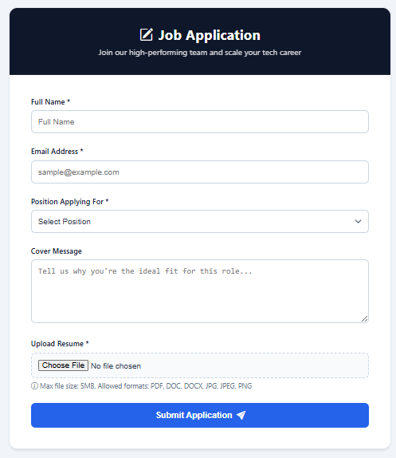
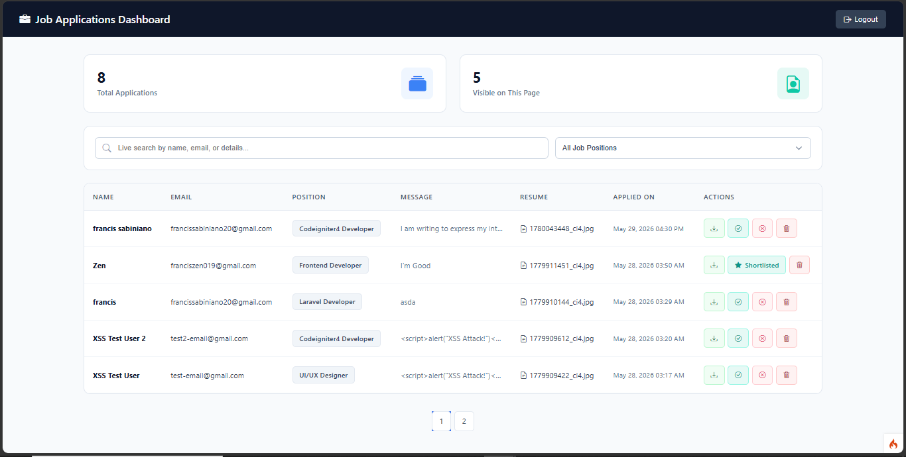
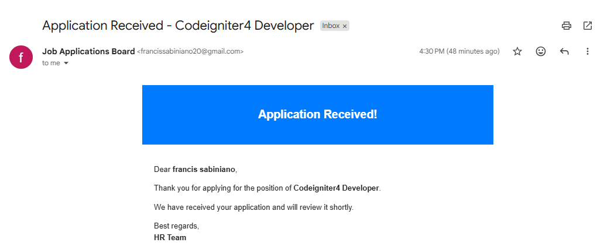
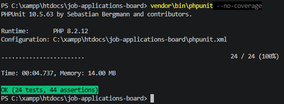

# 📋 Job Applications Board

A full-stack job application management system built with **CodeIgniter 4**, featuring secure file uploads, email notifications, pagination, search functionality, and an admin dashboard. Deployed on InfinityFree with Brevo SMTP integration.

---

# 🚀 Live Demo

| Access             | URL                                                       |
| ------------------ | --------------------------------------------------------- |
| **Applicant Form** | `https://job-application.infinityfreeapp.com`             |
| **Admin Login**    | `https://job-application.infinityfreeapp.com/admin/login` |

## Demo Admin Credentials

- **Email:** `admin@jobsboard.com`
- **Password:** `admin123`

---

# 📌 Table of Contents

- [Features](#-features)
- [Tech Stack](#-tech-stack)
- [Project Structure](#-project-structure)
- [Installation](#-installation)
- [Database Setup](#-database-setup)
- [Email Configuration](#-email-configuration)
- [Running Tests](#-running-tests)
- [Deployment](#-deployment-to-infinityfree)
- [Security Features](#-security-features)
- [Known Issues & Solutions](#-known-issues--solutions)
- [Contributors](#-contributors)
- [Course Information](#-course-information)
- [License](#-license)
- [Links](#-links)

---

# ✨ Features

## 🔐 Security (Week 11)

- **CSRF Protection** — Tokens on all POST forms
- **XSS Prevention** — `esc()` function on all user output
- Session-based admin authentication

## ⚙️ Advanced Features (Weeks 12–13)

- **File Uploads** — Resume upload with validation (`PDF`, `DOC`, `DOCX`, `JPG`, `PNG`, max `5MB`)
- **Email Notifications** — Auto-reply to applicants via Brevo SMTP
- **Pagination** — 5 applications per page with Bootstrap-styled links
- **Search & Filter** — Live search by name/email/position + dropdown position filter
- **Modal View** — Click any row to view full application details

## 🧪 Unit Testing (Week 14)

- **24 PHPUnit tests** with 44 assertions
- Model validation tests
- Controller response tests
- Security tests (`CSRF`, `XSS`)

## 🚀 Deployment (Week 15)

- Deployed on **InfinityFree**
- **Brevo SMTP** integration
- Custom `.htaccess` for URL routing

## 📊 Admin Dashboard Features

- View all applications with real-time status
- **Shortlist** candidates (sends congratulations email)
- **Reject** applications (sends polite rejection email)
- **Delete** applications (removes file from server)
- **Download** resumes with original filenames
- **Search** across all fields
- **Paginated** results (5 per page)
- **Status badges** (`Pending`, `Shortlisted`, `Rejected`)

---

# 🛠️ Tech Stack

| Category            | Technology                               |
| ------------------- | ---------------------------------------- |
| **Backend**         | CodeIgniter 4 (PHP 8.2+)                 |
| **Database**        | MySQL                                    |
| **Frontend**        | HTML5, CSS3, JavaScript, Bootstrap Icons |
| **Email**           | Brevo SMTP                               |
| **Testing**         | PHPUnit 10.5                             |
| **Hosting**         | InfinityFree                             |
| **Version Control** | Git & GitHub                             |

---

# 📁 Project Structure

```text
job-applications-board/
├── app/
│   ├── Config/
│   │   ├── Routes.php
│   │   ├── Email.php
│   │   └── Filters.php
│   ├── Controllers/
│   │   ├── Application.php
│   │   └── Admin.php
│   ├── Models/
│   │   └── ApplicationModel.php
│   └── Views/
│       ├── application/
│       │   ├── form.php
│       │   └── success.php
│       └── admin/
│           ├── login.php
│           └── applications.php
├── public/
│   ├── index.php
│   └── .htaccess
├── writable/
│   ├── uploads/
│   └── logs/
├── tests/
│   └── app/
│       ├── Controllers/
│       ├── Models/
│       └── SecurityTest.php
├── .env
├── .htaccess
└── README.md
```

---

# 💻 Installation

## Prerequisites

- PHP 7.4 or higher
- MySQL 5.7 or higher
- Composer
- XAMPP / WAMP / MAMP

---

## Step 1: Clone the Repository

```bash
git clone https://github.com/yourusername/job-applications-board.git

cd job-applications-board
```

---

## Step 2: Install Dependencies

```bash
composer install
```

---

## Step 3: Configure Environment

Copy the environment file:

```bash
cp env .env
```

Update `.env`:

```env
CI_ENVIRONMENT = development
app.baseURL = "http://localhost:8080/"

database.default.hostname = localhost
database.default.database = job_applications
database.default.username = root
database.default.password =
database.default.DBDriver = MySQLi
```

---

# 🗄️ Database Setup

Run the following SQL in phpMyAdmin:

```sql
CREATE DATABASE job_applications;

USE job_applications;

CREATE TABLE `applications` (
    `id` INT(11) NOT NULL AUTO_INCREMENT,
    `name` VARCHAR(100) NOT NULL,
    `email` VARCHAR(100) NOT NULL,
    `position` VARCHAR(100) NOT NULL,
    `message` TEXT,
    `resume_file` VARCHAR(255) NOT NULL,
    `status` ENUM('pending', 'shortlisted', 'rejected') DEFAULT 'pending',
    `created_at` TIMESTAMP NOT NULL DEFAULT CURRENT_TIMESTAMP,
    PRIMARY KEY (`id`)
);
```

---

## Step 4: Create Uploads Folder

```bash
mkdir writable/uploads

chmod 755 writable/uploads
```

---

## Step 5: Run Local Server

```bash
php spark serve
```

Visit:

```text
http://localhost:8080
```

---

# 📧 Email Configuration

## Local Development (Gmail SMTP)

Add this to `.env`:

```env
email.protocol = smtp
email.SMTPHost = smtp.gmail.com
email.SMTPUser = your-email@gmail.com
email.SMTPPass = your-app-password
email.SMTPPort = 587
email.SMTPCrypto = tls
email.fromEmail = your-email@gmail.com
email.fromName = Job Applications Board
```

---

## Production (Brevo SMTP)

1. Sign up at Brevo
2. Verify your sender email
3. Update `.env`

```env
email.protocol = smtp
email.SMTPHost = smtp-relay.brevo.com
email.SMTPUser = your-brevo-smtp-user
email.SMTPPass = your-brevo-smtp-key
email.SMTPPort = 587
email.SMTPCrypto = tls
email.fromEmail = your-verified-email@gmail.com
email.fromName = Job Applications Board
```

---

# 🧪 Running Tests

## Run All Tests

```bash
vendor/bin/phpunit
```

## Run Without Coverage

```bash
vendor/bin/phpunit --no-coverage
```

## Run Specific Test File

```bash
vendor/bin/phpunit tests/app/Models/ApplicationModelTest.php
```

### Expected Output

```text
OK (24 tests, 44 assertions)
```

---

# 🚀 Deployment to InfinityFree

## Step 1: Create an Account

- Sign up at InfinityFree
- Create a website with a free subdomain

---

## Step 2: Create Database

- Open **MySQL Databases** in vPanel
- Create a database
- Copy database credentials

---

## Step 3: Export & Import Database

- Export your local database using phpMyAdmin
- Import it into the hosting database

---

## Step 4: Upload Files

- Upload project files to the `htdocs/` directory
- Set `writable/` permissions to `755`

---

## Step 5: Configure Production `.env`

```env
CI_ENVIRONMENT = production
app.baseURL = "https://your-site.infinityfreeapp.com/"

database.default.hostname = sqlXXX.infinityfree.com
database.default.database = your_database_name
database.default.username = your_database_user
database.default.password = your_password
database.default.DBDriver = MySQLi
```

---

## Step 6: Create `.htaccess` Files

### Root `.htaccess`

```apache
<IfModule mod_rewrite.c>
    RewriteEngine On
    RewriteBase /
    RewriteRule ^(.*)$ public/$1 [L]
</IfModule>
```

### `public/.htaccess`

```apache
<IfModule mod_rewrite.c>
    RewriteEngine On
    RewriteBase /public/
    RewriteCond %{REQUEST_FILENAME} !-f
    RewriteCond %{REQUEST_FILENAME} !-d
    RewriteRule ^(.*)$ index.php/$1 [L]
</IfModule>
```

---

## 📸 Screenshots

### Applicant Form



### Admin Dashboard



### Email Notification



### PHPUnit Tests



---

# 🔒 Security Features

| Feature                  | Implementation                                     |
| ------------------------ | -------------------------------------------------- |
| CSRF Protection          | `csrf_field()` on forms + CSRF filter enabled      |
| XSS Prevention           | `esc()` function on user-controlled output         |
| SQL Injection Prevention | Query Builder with automatic escaping              |
| File Upload Security     | MIME validation + extension whitelist + size limit |
| Session Security         | Session ID regeneration on login                   |

---

# 🐛 Known Issues & Solutions

| Issue                             | Solution                                  |
| --------------------------------- | ----------------------------------------- |
| Email not sending on InfinityFree | Use verified sender email in Brevo        |
| 404 on admin pages                | Check `.htaccess` configuration           |
| File download corrupt             | Add proper MIME types                     |
| PHPUnit database errors           | Use database-free tests on shared hosting |

---

# 👥 Contributors

| Role                                   | Name                                   |
| -------------------------------------- | -------------------------------------- |
| Security Lead (CSRF/XSS)               | Sabiniano, Francis Jr.                 |
| Features Lead (Uploads/Email)          | Surigao, Sean Howard                   |
| Frontend/Data Lead (Pagination/Search) | Francisco, Reyna and Justalero, Justin |
| QA/Test Lead (PHPUnit/Debugging)       | Varquez, Diane                         |
| DevOps Lead (Deployment)               | Francisco, Kennev                      |

---

# 📚 Course Information

| Detail     | Information              |
| ---------- | ------------------------ |
| Course     | Advanced Web Development |
| Framework  | CodeIgniter 4            |
| Instructor | Edward Grageda           |
| Project    | Final Project            |

---

# 📄 License

This project was created for educational purposes as part of the Advanced Web Development course.

---

# 🔗 Links

| Resource           | URL                                                      |
| ------------------ | -------------------------------------------------------- |
| Live Demo          | `https://job-application.infinityfreeapp.com`            |
| GitHub Repository  | `https://github.com/ZeroPhantom0/job-applications-board` |
| Brevo SMTP         | `https://www.brevo.com`                                  |
| InfinityFree       | `https://www.infinityfree.net`                           |
| CodeIgniter 4 Docs | `https://codeigniter4.github.io/CodeIgniter4`            |
